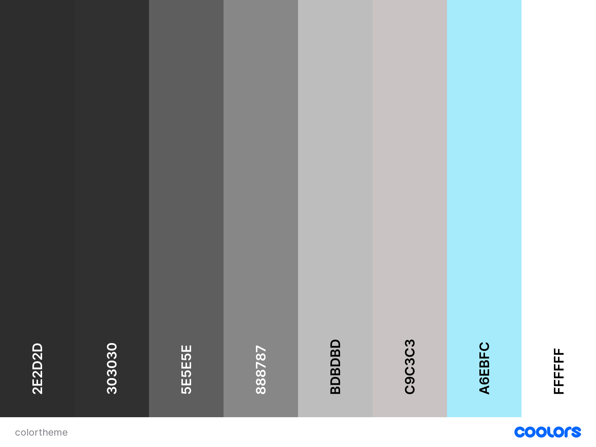

# Burn and Beyond Website

This site has been created to showcase the company's services, projects, webshop and to introduce Burn and Beyond.

Are you looking for a professional laser technology company?
Do not search any further you have found it. Browse from our services, projects, webshop or contact us to disguss your idea!

Head to the deployed site at [Burn and Beyond](https://nmyhi.github.io/burnandbeyond/).

## Table of Contents
* [User Experience](#User-Experience)
  * [Initial Discussion](#Initial-Discussion)
  * [Demographic](#Demographic)
  * [User Stories](#User-Stories) 
  * [Strategic Trade offs](#Strategic-Trade-offs)
* [Design](#Design)
  * [Colour Scheme](#Colour-Scheme)
  * [Typography](#typography)
  * [Imagery](#Imagery)
  * [Wireframes/Sitemap](#Wireframes/Sitemap)
  * [Features](#Features)
  * [Future Implementations](#Future-Implementations)
  * [Accessibility](#Accessibility)
* [Technologies Used](#Technologies-Used)
  * [Languages Used](#Languages-Used)
  * [Software, Frameworks & Libraries Used](#Software,-Frameworks-&-Libraries-Used)
* [Testing](#Testing)
  * [Validation](#Validation)
  * [Fixed Bugs](#Fixed-Bugs)
  * [Known Issues](#Known-Issues)
  * [Testing User Stories](#Testing-User-Stories)
  * [Lighthouse](#Lighthouse)
    * [Index Page](#Index-Page)
    * [Products Page](#Products-Page)
    * [Reviews Page](#Reviews-Page)
    * [Gallery Page](#Gallery-Page)
    * [Contact Page](#Contact-Page)
  * [Manual Testing](#Manual-Testing)
* [Deployment & Local Development](#Deployment-&-Local-Development)
  * [Deploying to Github Pages](#Deploying-to-Github-Pages)
  * [Local Development](#Local-Development)
    * [How to Fork](#How-to-Fork)
    * [How to Clone](#How-to-Clone)
  * [Credits](#Credits)
    * [Images](#Images)
    * [Acknowledgement](#Acknowledgement)

## User Experience
### Initial Discussion

Burn and Beyond is a small laser cutting and engraving company located in Hatfield (UK). We provide a wide range of services and various artistic items for companies and people. Burn and Beyond want to provide a platform where customers can get faimiar with the company and their products.

### Demographic

With the site being in the edge of London there is a wide range of people who may be interested in their services and products.

* Young professionals
* Business owners
* Light Designers
* Interior designers
* Exterior designers
* All age group of Etsy users

### User Stories

* Client goals
    - To have an online presence.
    - Display a wide range of information on the site like: products, projects, services.
    - Increase traffic to a physical site.
    - Increase interactions with customers via social media and contact form.

* First time Visitor goals
    - Being able to navigate the site easily.
    - Being able to access the menu and pages including getting in touch.
    - Find out about products and services.

* Returning visitor goals.
    - Find out about new services, products and projects.
    - To be able to access the company's social media sites and the quotation form in case they want to send new requests.

* Frequent visitor goals
    - Using the webshop to click and order prodects they liked before.

### Strategic Trade offs

| Opportunity/Problem | Importance | Viability/Feasability |
| ----------- | ----------- | ----------- |
| Create an online presence | 5 | 5 |
| Display the range of services and products on the site | 5 | 3 |
| Increase social media interaction | 3 | 4 |
| Provide opportunity to get in touch | 5 | 3 |
| Showcase gallery images | 3 | 5 |
| Total | 21 | Avg 20 |

Above I have listed documented some trade-offs and I will explain the reasoning behind them.

- Online presence
  - This is mandatory and should be achievable given that I am a Front-End Web Developer(the course upto now has given everything I need to achieve this).

- Display the range of services and products on the site
  - Not as important as an online presence, but most definitely still up there. I feel it is also feasible given my skillset, however this company is still quite small in size
   therefore there is not too many things to showcase.

- Social media interaction
  - Again, this is well within my skillset as this could be something as simple as a CTA or footer icons with links to social media.

- Provide opportunity to get in touch
  - In order to get in touch I can provide a company email and a contact form with all the details of the company, however being a front-end developer I feel like this problem is not fully solved yet, because of the lack of back-end knowledge. (the contact form is not fully functioning.)

- Showcase gallery images
  - This is a fully achiveable goal through different photoes I have collected throughtout the company's lifetime.
  
## Design

### Colour Scheme

I wanted to use a colour scheme that wasn't going to distract too much from the text but also make the website pop, and look fun. I felt like the approach is to use various shades of grey with few vibrant colours like a shade of blue, white and silver.

 

### Typography

I decided that I didn't want to overcomplicate the typography, and settled on Roboto and Oxygen with a fallback font of Sans-serif. 

Font weights for Roboto are regular(300) and medium(500) and bold. Regular is used for the text on the pages and medium, bold are used for headings.

### Imagery

Being a local lasercutting company I decided to use as many own images as possible, however I used few stock and AI generated photos as well.

- External sources:

- Free stock photo site:

[Unsplash](https://unplash.com "Stock photo site")

- Free Photo generator AI:

[Dall-e-2](https://openai.com/product/dall-e-2 "Photo generator site")

- Free photo editor for formatting my own pictures.

[Gimp](https://www.gimp.org "free photo manipulator software")

- Free open source video editor to transform the index page hero video.

[Shotcut](https://shotcut.org/download/ "free, open source video editor software")

[Shotcut-github-repository](https://github.com/mltframework/shotcut "Github repository")

### Wireframe/sitemap

Burn and Beyond Sitemap

The sitemap allows me to get a higher-level view of how the users will navigate the site. Portfolio and services, webshop are being the priority for returning customers, then gallery, about us, webshop are for the first-time users and contact for frewuent users.

[Sitemap](assets/images/readme/sitemap.png)

[Mobile Wireframe](assets/images/readme/mobile-wireframe.png)

[Tablet wireframe](assets/images/readme/tablet-wireframe.png)

[Desktop wireframe](assets/images/readme/desktop-wireframe.png)

Wireframes were initially created using [balsamiq](https://balsamiq.com/wireframes/ "Balsamiq Wireframes Software") windows version.

### Features

Burn and Beyond consist 4 pages and a link to a 3rd party webshop page (etsy). (Home About Gallery Webshop Contact).

Features in common accross the site include: 

* A responsive navigation bar across the top of the site. This allows users on different screen sizes to view the same site on any device. On the left hand side of the navbar we have the Burn and Beyond logo and on the right hand side there are navigation links:

  * Burn and Beyond logo: navigates back to the index.html page.

  * Home: navigates back to the index.html page

  * About: navigates to the about.html page which contains more information about the company.

  * Gallery: navigates to the gallery.html page which contains various pictures of different orders and products furthermore pictures of the machine and other accessories.

  * Webshop: navigates to the company's Etsy page.

  * Contact: navigates ot the company's contact form made for questions, quotations and general questions.

There is also a hamburger menu icon included in the navbar which allows for a better user experience on smaller devices.

A footer and a contact section is inluded across all pages of the site with social media icons which open in a new window and the company email, phone and address.

* Home page:
  * A hero video of a laser-cutter machine in work.
  * A welcome text, "Unleash Laser Precision: Welcome to Burn and Beyond!.
  * Our lasercutting services consists the most popular services of the company.
  * The portfolio section consists the most recent projects of the company.
  * The materials section provides information about the different materials we utilize.

* About page:
  * A hero image of a laser-cutter cnc machine.
  * A welcome text.
  * Additional information about the company.

* Gallery page:
  * A hero image of a fictional gallery generated by an AI ([Dall-E-2](https://openai.com/dall-e-2 "Dall-E-2 open AI")).
  * Different images of various products and projects.

* Webshop:
  * A link to the company's Etsy page.

* Contact:
  * A hero image of a business man with a pan and a piece of paper.
  * Contact form for questions, quotations and general questions.

### Future Implementations

* Add a fully functional webshop instead of using a 3rd party company for this purpose.
* Develop a more engaging project and portfolio section using Java script.

### Accessibility

Whilst coding the site I have ensured that the site is accesible for all. This is achieve by using:

* Google Dev tools to check contrast of items. 
* Alt tags to describe the images on site.
* Using semantic HTML

## Technologies Used

### Languages Used 

* HTML and CSS
* JavaScript - however this was the Hamburger Dropdown from a youtube video.

### Software, Frameworks & Libraries Used

* [Balsamiq](https://www.balsamiq.com/wireframes "Balsamiq Wireframing Tool") was used to create the wireframes/sitemap for the site.
* [Font Awesome](https://fontawesome.com/icons "Font Awesome 6.2.1 Free Icons") was used for the social media icons in the footer.
* [Chrome Developer Edition](https://developer.chrome.com/docs/devtools "Chrome Developer Tools") this was used to find out specific styling of elements and to identify and resolve problems related to responsiveness and appearance.
* [Google Fonts](fonts.google.com "Google Fonts") we used the Roboto font and also the Oxygen font.
* [Github](https://github.com/ "Github") was used to store my project in a repository. 
* [Git](https://git-scm.com/ "Git Version Control") was used for Version Control.
* [Google](https://www.google.co.uk "Google Search Engine") was used to research HTML & CSS.
* [Gitpod](https:://www.gitpod.io "Gitpod Cloud IDE") the vast majority of my time was spent inside GitPod's VSCode Cloud IDE.
* [Gimp](https://www.gimp.org/ "free photo editor") was used to reduce file size of an image.
* [Shotcut](https://shotcut.org/download/ "free, open source video editor software") was used for formatting the index page's hero video.

## Testing

### Validation

### Fixed Bugs

### Known Issues

### Testing User Stories

### Lighthouse
 #### Index Page

 #### Gallery Page

 #### Contact Page
 The Reviews page Lighthouse results can be found here [Reviews Page Lighthouse](assets/readme/docs/reviews-lighthouse.png)
 #### About Page

 #### Contact Page

### Manual Testing

#### Mobile

#### Tablet 

#### Desktop

## Deployment & Local Development

### Deploying to Github Pages

### Local Development

#### How To Fork

#### How To Clone

## Credits

### Images

### Acknowledgement

