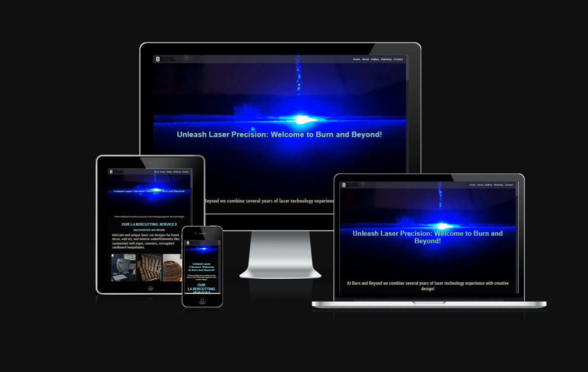

# Burn and Beyond - TESTING

This site has been created to showcase the company's services, projects, webshop and to introduce Burn and Beyond.

Are you looking for a professional laser technology company?
Do not search any further you have found it. Browse from our services, projects, webshop or contact us to disguss your idea!

Head to the deployed site at [Burn and Beyond](https://nmyhi.github.io/burnandbeyond/).

## CONTENTS

* [AUTOMATED TESTING](#AUTOMATED-TESTING)
  * [W3C Validator](#W3C-Validator)
  * [Lighthouse](#Lighthouse)
* [MANUAL TESTING](#MANUAL-TESTING)
  * [Testing User Stories](#Testing-User-Stories)
  * [Full Testing](#Full-Testing)

Testing was ongoing throughout the entire build. I have utilised Chrome developer tools whilst building to pinpoint and troubleshoot any issues as we went along.

Each page has been inspected using google chrome developer tools to ensure that each page is fully responsive on a variety of different screen sizes and devices. I have also physically tested the responsiveness of the site on a number of different devices.

- - -

## AUTOMATED TESTING

### W3C Validator

[W3C](https://validator.w3.org/) was used to validate the HTML on all pages of the website. It was also used to validate the CSS.

* [Index Page HTML](assets/images/readme/burnandbeyond-index-validation.png) - Pass
* [About Page HTML](assets/images/readme/burnandbeyon-about-validation.png) - Pass
* [Gallery Page HTML](assets/images/readme/burnandbeyond-gallery-validation.png) - Pass
* [Contact Page HTML](assets/images/readme/burnandbeyond-contact-validation.png) - Pass
* [Stylesheet style.css](assets/images/readme/burnandbeyond-stylesheet-validation.png) - Pass

- - -

### Lighthouse

I used Lighthouse within the Chrome Developer Tools to test the performance, accessibility, best practices and SEO of the website.

* Index Page
  ! The Index page Lighthouse results can be found here [Index Page Lighthouse](assets/images/readme/indexpage-lighthouse.png)

* About Page
  ! The About page Lighthouse results can be found here [About Page Lighthouse](assets/images/readme/aboutpage-lighthouse.png)
  
* Gallery Page
  ! The Gallery page Lighthouse results can be found here [Gallery Page Lighthouse](assets/images/readme/gallerypage-lighthouse.png)
  
* Contact Page
  ! The Contact page Lighthouse results can be found here [Contact Page Lighthouse](assets/images/readme/contactpage-lighthouse.png)

## MANUAL TESTING

### Testing User Stories

* Client goals
    - To have an online presence.
    - Display a wide range of information on the site like: products, projects, services.
    - Increase traffic to a physical site.
    - Increase interactions with customers via social media and contact form.

* First time Visitor goals
    - Being able to navigate the site easily.
    - Being able to access the menu and pages including contact details.
    - Find out about products and services.

* Returning visitor goals.
    - Find out about new services, products and projects.
    - To be able to access the company's social media sites and the quotation form in case they want to send new requests.

* Frequent visitor goals
    - Using the webshop to click and order products they liked before.

`Client Goals` 

| Goals | How are they achieved? | Image |
| :--- | :--- | :--- |
| To have an online presence. | I hae achieved this by creating this site. | [Online-presence](assets/images/readme/index-page-desktop.png)
| Display a wide range of information on the site like: products, projects, services. | I have made every effort to provide useful information about the company, I have achieved this by showcasing the features and telling more about it in the About us section  | [About-us image](assets/images/readme/about-page-desktop.png) |
| Increase traffic to a physical site | Simply with the online presence and with social marketing campaigns I can achieve this goal| n/a |
| Increase interactions with customers via social media and contact form | I have achieved this goal via providing social media platform links in the footer and a contact form in the web application | [footer](assets/images/readme/footer.png) |

`First time visitor goals`

|  Goals | How are they achieved? | Image |
| :--- | :--- | :--- |
| Being able to navigate the site easily | I have achieved this goal by implementing a navigation bar and a mobile menu | [navigation bar](assets/images/readme/burnandbeyonddesktopnavbar.png) |
| Being able to access the menu and pages including contact details. | Apart from having a nav bar, I have achieved this goal with providing a contact us section on each page | [contact-us](assets/images/readme/contact-us-section-with-footer.png) |
| Find out about products and services. | I achieved this goal by showcasing the products and services on the index page [Online-presence](assets/images/readme/index-page-desktop.png) and providing a link to the webshop as well | [webshop](assets/images/readme/etsy-webshop-full-page.png) |

`Returning visitor goals`

| Goals | How are they achieved? | Image |
| :--- | :--- | :--- |
| Find out about new services, products and projects | This goal could be achieved with updating the new products on the index page and by visiting the webshop | n/a|
| To be able to access the company's social media sites and the quotation form in case they want to send new requests. | This goal is fulfilled by having a contact form and all of the contact information showed on the web application | n/a |

`Frequent visitor goals`

| Goals | How are they achieved? | Image |
| :--- | :--- | :--- |
| Using the webshop to click and order products they liked before. | This goal is achieved by a fully functioning 3rd party webshop provider I have linked in the nav bar | n/a |

- - -

### Full Testing

Full testing was performed on the following devices:

* Laptop:
  * hp pavilion 15" laptop
* Mobile Devices:
  * iPhone 13 pro.
  * Samsung galaxy S10.
  * Samsung galaxy A22.

Each device tested the site using the following browsers:

* Google Chrome

Additional testing was taken by friends and family on a variety of devices and screen sizes.  

Feature | Expected Outcome | Testing Performed | Result | Pass/Fail |
| --- | --- | --- | --- | --- |
| `Navbar` |
| Site logo | Redirects to the home page | Click logo |  Redirects to home page | Pass |
| Home Link | Redirects to home page | Click home link | Redirects to home page | Pass |
| About Link | Redirects to the About page | Click About link | Redirects to About page | Pass |
| Gallery Link | Redirects to the Gallery page | Click Galley link | Redirects to Gallery page | Pass |
| Webshop Link | Redirects to the Etsy webshop page in a new window | Click Webshop link | Redirects to the Etsy webshop page in a new window | Pass |
| Contact Link | Redirects to the Contact page | Click Contact link | Redirects to the Contact page | Pass |
| `Home Page` |
| Hero video | Plays a hero video | Testing by loading the page | The hero video plays | Pass |
| Images hover effect | When the mouse is above the images the border styling changes | Testing by hovering above the pictures | The boarders behaving as expected | Pass |
| Fixed materials background picture | As the page scrolling the background picture remains "fixed" | Testing by scrolling the page | The background picture behaves as expected | Pass |
| Contact button above the footer | Redirects to the contact page | Click button | Redirects to the contact page | Pass |
| Footer social-media links | The links open the correcponding social-media platform page in a new window | Click button | All of the links open the correcponding social-media platform page in a new window | Pass |
| `About Page` |
| Contact button above the footer | Redirects to the contact page | Click button | Redirects to the contact page | Pass |
| Footer social-media links | The links open the correcponding social-media platform page in a new window | Click button | All of the links open the correcponding social-media platform page in a new window | Pass |
| `Gallery Page` |
| Contact button above the footer | Redirects to the contact page | Click button | Redirects to the contact page | Pass |
| Footer social-media links | The links open the correcponding social-media platform page in a new window | Click button | All of the links open the correcponding social-media platform page in a new window | Pass |
| `Webshop Page` |
| Webshop Link | Redirects to the Etsy webshop page in a new window | Click Webshop link | Redirects to the Etsy webshop page in a new window | Pass |
| `Contact Page` |
| Quotation form filling up | The form would not let you to send information with missing contact information | Tryed to skip different contact information but the form would not let the customer submit the form with the missing information or incorrect emal address format. Works as expected | Pass |
| Quotation form submit | Collects quotations and questions from customers | Filling the form up and clicking Submit | Due to the lack of Back and knowledge this feature does not work | Fail |
| Footer social-media links | The links open the correcponding social-media platform page in a new window | Click button | All of the links open the correcponding social-media platform page in a new window | Pass |

Back to [README.md](README.md)